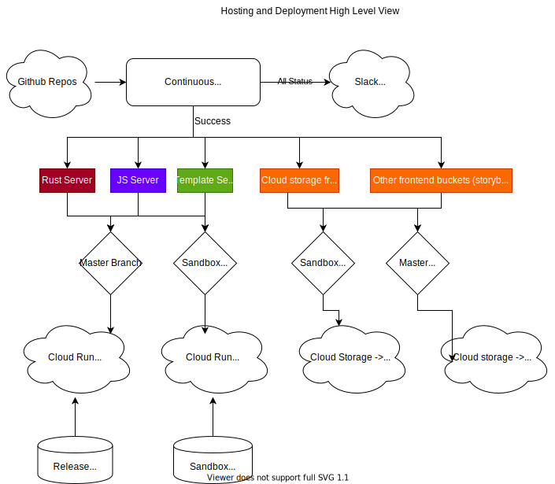

    

# Firebase vs GCS

Full standalone static sites, such as Storybook and this documentation, are served via Firebase hosting

All other static files - even if they comprise javascript that are used on other sites, are served via Google Cloud Storage and the Fastly CDN in front of it

# CDN

* TODO - document GCS, GCF, and Fastly: https://github.com/fastly/purge-fastly-gcs-trigger

## Notes:

* The release/sandbox split is consistent. A sandbox frontend will hit sandbox server which hits sandbox sql
* There are several firebase static hosting endpoints. It's primarily split to keep frontend weight down, but also to allow for different ad-hoc sites (such as the internal storybook tooling, or perhaps a simpler statically generated FAQ/help site, etc.
* The servers are exactly one per type (i.e. there is only one template server even if it serves content from different static firebase endpoints.). Cloud-run will scale horizontally as needed

